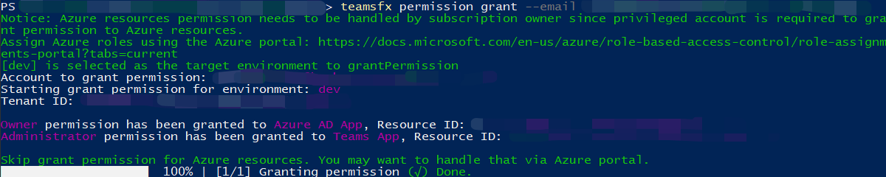

# <a name="teamsfx-command-line-interface"></a>TeamsFx コマンド ライン インターフェイス

TeamsFx CLI は、テキスト ベースのコマンド ライン インターフェイスで、アプリケーションの開発Teamsを加速します。 これは、キーボード中心のエクスペリエンスを提供し、アプリケーションを構築Teams目的です。 また、自動化のためのスクリプトに CLI を簡単に統合できる CI/CD シナリオも有効になります。

* [ソース コード](https://github.com/OfficeDev/TeamsFx/tree/dev/packages/cli) 
* [パッケージ (NPM)](https://www.npmjs.com/package/@microsoft/teamsfx-cli)

## <a name="get-started"></a>はじめに

最初に、使用可能なすべてのコマンドを確認するためにインストールして `teamsfx-cli` `npm` `teamsfx -h` 実行します。

```bash
  npm install -g @microsoft/teamsfx-cli
  teamsfx -h
```

## <a name="supported-commands"></a>サポートされているコマンド

| `teamsfx` コマンド  | 説明 |
|:----------------  |:-------------|
| `teamsfx new`       | 新しいアプリケーションをTeamsします。 |
| `teamsfx account`   | クラウド サービス アカウントを管理します。 サポートされているクラウド サービスは'Azure' と 'Microsoft 365' です。          |
| `teamsfx env`       | 環境を管理します。 |
| `teamsfx capability`| 現在のアプリケーションに新しい機能を追加します。         |
| `teamsfx resource`  | 現在のアプリケーションのリソースを管理します。         |
| `teamsfx provision` | 現在のアプリケーションでクラウド リソースをプロビジョニングします。             |
| `teamsfx deploy`    | 現在のアプリケーションを展開します。  |
| `teamsfx package`   | 発行用Teamsアプリをビルドします。         |
| `teamsfx validate`  | 現在のアプリケーションを検証します。             |
| `teamsfx publish`   | アプリを公開して、Teams。             |
| `teamsfx preview`   | 現在のアプリケーションをプレビューします。 |
| `teamsfx config`    | 構成データを管理します。 |
| `teamsfx permission`| 同じプロジェクト内の他の開発者と共同作業を行います。|

## `teamsfx new`

`teamsfx new`既定では対話型モードに入り、いくつかの質問をして新しいアプリケーションを作成するプロセスTeamsガイドします。 フラグをに設定すると、非対話型モード `--interactive` でも実行できます `false` 。

| `teamsFx new` コマンド  | 説明 |
|:----------------  |:-------------|
| `teamsfx new template <template-name>`     | 既存のテンプレートからアプリを作成する |
| `teamsfx new template list`     | 使用可能なすべてのテンプレートを一覧表示する |

### <a name="parameters-for-teamsfx-new"></a>パラメーター `teamsfx new`

| パラメーター  | 必須 | 説明 |
|:----------------  |:-------------|:-------------|
|`--app-name` | はい| アプリケーションの名前Teamsします。|
|`--interactive`| 不要 | オプションを対話的に選択します。 オプションは `true` とです `false` 。 既定値は `true` です。|
|`--capabilities`| 不要| アプリケーションTeamsを選択し、複数のオプションを選択します `tab` 。 `bot` `messaging-extension` `tab-spfx` 既定値は次の値です `tab` 。|
|`--programming-language`| 不要| プロジェクトのプログラミング言語。 オプションは `javascrip` 次のとおりです `typescript` 。既定値は次のとおりです `javascript` 。|
|`--folder`| 不要 | Projectディレクトリ。 アプリ名を持つサブ フォルダーは、このディレクトリの下に作成されます。 既定値は次の値です `./` 。|
|`--spfx-framework-type`| 不要| 機能が選択 `Tab(SPfx)` されている場合に適用されます。 Frontend Framework。 オプションは `none` 次のとおりです `react` 。既定値は次のとおりです `none` 。|
|`--spfx-web part-name`| 不要 | 機能が選択 `Tab(SPfx)` されている場合に適用されます。 Web パーツの名前。 既定値は "helloworld" です。 |
|`--spfx-web part-desp`| 不要 | 機能が選択 `Tab(SPfx)` されている場合に適用されます。 Web パーツの説明。 既定値は "helloworld description" です。 |
|`--azure-resources`| 不要| 機能が含まれている場合に `tab` 適用されます。 Azure リソースをプロジェクトに追加します。 Options(Multiple) は `sql` (Azure SQL Database) `function` と (Azure Functions) です。 |

### <a name="scenarios-for-teamsfx-new"></a>シナリオ `teamsfx new`

対話型モードを使用してアプリを作成Teams直感的なアプリを作成するには、最初から試してみてください `teamsfx new` 。 以下に、すべてのパラメーターを制御するシーンリオを示します。

#### <a name="a-tab-app-hosted-on-spfx-using-react"></a>アプリを使用して、SPFxでReact

```bash
teamsfx new --interactive false --app-name newspfxapp --capabilities tab-spfx --spfx-framework-type react
```

#### <a name="a-teams-app-in-javascript-contains-tab-bot-capabilities-and-azure-functions"></a>JavaScript Teamsアプリには、タブ、ボット機能、Azure Functions が含まれています

```bash
teamsfx new --interactive false --app-name newtabbotapp --capabilities tab bot --programming-language javascript --azure-resources function
```

#### <a name="a-teams-tab-app-with-azure-functions-and-azure-sql"></a>Azure Teams Azure 関数と Azure 関数を含むアプリSQL

```bash
teamsfx new --interactive false app-name newapp --azure-resources sql function --programming-language typescript
```

## `teamsfx account`

クラウド サービス アカウントを管理します。 サポートされているクラウド サービスは `Azure` 、 です `Microsoft 365` 。

| `teamsFx account` コマンド  | 説明 |
|:----------------  |:-------------|
| `teamsfx account login <service>`      | 選択したクラウド サービスにログインします。 |
| `teamsfx account logout <service>`      | 選択したクラウド サービスからログアウトします。 |
| `teamsfx account set --subscription`      | アカウント設定を更新してサブスクリプション ID を設定します。 |

## `teamsfx env`

環境を管理します。

| `teamsfx env` コマンド  | 説明 |
|:----------------  |:-------------|
| `teamsfx env add <new_env_name> --env <existing_env_name>` | 指定した環境からコピーして、新しい環境を追加します。 |
| `teamsfx env list` | すべての環境を一覧表示します。 |

### <a name="scenarios-for-teamsfx-env"></a>シナリオ `teamsfx env`

#### <a name="create-a-new-environment"></a>新しい環境を作成する

既存の開発環境からコピーして新しい環境を追加します。

```bash
teamsfx env add staging --env dev
```

## `teamsfx capability`

現在のアプリケーションに新しい機能を追加します。

| `teamsFx capability` コマンド  | 説明 |
|:----------------  |:-------------|
| `teamsfx capability add tab`      | タブを追加します。 |
| `teamsfx capability add bot`      | ボットを追加します。 |
| `teamsfx capability add messaging-extension`      | メッセージング拡張機能を追加します。 |

> [!NOTE]
> プロジェクトにボットが含まれると、メッセージング拡張機能を追加することはできません。また、その逆も適用されます。 新しいアプリ プロジェクトを作成するときに、ボット拡張機能とメッセージング拡張機能の両方Teamsできます。

## `teamsfx resource`

現在のアプリケーションのリソースを管理します。 サポートされる `<resource-type>` 機能は、 `azure-sql` 次 `azure-function` のとおりです `azure-apim` 。

| `teamsFx resource` コマンド  | 説明 |
|:----------------  |:-------------|
| `teamsfx resource add <resource-type>`      | 現在のアプリケーションにリソースを追加します。|
| `teamsfx resource show <resource-type>`      | リソースの構成の詳細を表示します。 |
| `teamsfx resource list`      | 現在のアプリケーションのすべてのリソースを一覧表示します。 |

### <a name="parameters-for-teamsfx-resource-add-azure-function"></a>パラメーター `teamsfx resource add azure-function`

| パラメーター  | 必須 | 説明 |
|:----------------  |:-------------|:-------------|
|`--function-name`| はい | 関数名を指定します。 既定値は次の値です `getuserprofile` 。 |

### <a name="parameters-for-teamsfx-resource-add-azure-sql"></a>パラメーター `teamsfx resource add azure-sql`

#### `--function-name`

| パラメーター  | 必須 | 説明 |
|:----------------  |:-------------|:-------------|
|`--function-name`| はい | 関数名を指定します。 既定値は次の値です `getuserprofile` 。 |

> [!NOTE]
> 関数名は、サーバーワークロードSQLする必要がある場合に検証されます。 プロジェクトに含めなかった場合 `Azure Functions` は、プロジェクトが自動的に作成されます。

### <a name="parameters-for-teamsfx-resource-add-azure-apim"></a>パラメーター `teamsfx resource add azure-apim`

> [!TIP]
> 以下のオプションは、既存のインスタンスを使用しようとするときに有効 `APIM` になります。 既定では、オプションを指定する必要がなく、手順中に新しいインスタンスが作成 `teamsfx provision` されます。

| パラメーター  | 必須 | 説明 |
|:----------------  |:-------------|:-------------|
|`--subscription`| はい | Azure サブスクリプションの選択|
|`--apim-resource-group`| はい| リソース グループの名前。 |
|`--apim-service-name`| はい | API Management サービス インスタンスの名前。 |
|`--function-name`| はい | 関数名を指定します。 既定値は次の値です `getuserprofile` 。 |

> [!NOTE]
> 関数名を求めるのは、 を `Azure API Management` 使用する必要があるからです `Azure Functions` 。 プロジェクトに含めなかった場合 `Azure Functions` は、プロジェクトを作成します。

## `teamsfx provision`

現在のアプリケーションでクラウド リソースをプロビジョニングします。

### <a name="parameters-for-teamsfx-provision"></a>パラメーター `teamsfx provision`

| パラメーター  | 必須 | 説明 |
|:----------------  |:-------------|:-------------|
|`--env`| はい| プロジェクトの環境を選択します。 |
|`--subscription`| 不要 | Azure サブスクリプション ID を指定します。 |
|`--resource-group`| 不要 | 既存のリソース グループの名前を設定します。 |
|`--sql-admin-name`| 不要 | プロジェクトにリソースSQLがある場合に適用されます。 管理者の名前SQL。|
|`--sql-password`| 不要| プロジェクトにリソースSQLがある場合に適用されます。 管理者パスワードのSQL。|

## `teamsfx deploy`

このコマンドは、現在のアプリケーションを展開するために使用されます。 既定では、プロジェクト全体が展開されますが、部分的に展開できます。 Options(Multiple) は、 `frontend-hosting` 、 、 、 、 `function` `apim` `teamsbot` です `spfx` 。

### <a name="parameters-for-teamsfx-deploy"></a>パラメーター `teamsfx deploy`

| パラメーター  | 必須 | 説明 |
|:----------------  |:-------------|:-------------|
|`--env`| はい| プロジェクトの既存の環境を選択します。 |
|`--open-api-document`| 不要 | プロジェクトに APIM リソースがある場合に適用されます。 Open API ドキュメント ファイルパス。 |
|`--api-prefix`| 不要 | プロジェクトに APIM リソースがある場合に適用されます。 API 名のプレフィックス。 API の既定の一意の名前はです `{api-prefix}-{resource-suffix}-{api-version}` 。 |
|`--api-version`| 不要 | プロジェクトに APIM リソースがある場合に適用されます。 API のバージョン。 |

## `teamsfx validate`

現在のアプリケーションを検証します。 このコマンドは、アプリケーションのマニフェスト ファイルを検証します。

### <a name="parameters-for-teamsfx-validate"></a>パラメーター `teamsfx validate`

`--env`: (必須) プロジェクトの既存の環境を選択します。

## `teamsfx publish`

アプリを公開して、Teams。

### <a name="parameters-for-teamsfx-publish"></a>パラメーター `teamsfx publish`

`--env`: (必須) プロジェクトの既存の環境を選択します。

## `teamsfx package`

発行用Teamsアプリをビルドします。

## `teamsfx preview`

ローカルまたはリモートから現在のアプリケーションをプレビューします。

### <a name="parameters-for-teamsfx-preview"></a>パラメーター `teamsfx preview`

| パラメーター  | 必須 | 説明 |
|:----------------  |:-------------|:-------------|
|`--local`| 不要 | ローカルからアプリケーションをプレビューします。 `--local` で排他的です `--remote` 。 |
|`--remote`| 不要 | リモートからアプリケーションをプレビューします。 `--remote` で排他的です `--local` 。 |
|`--env`| 不要 | パラメーターを追加するときに、プロジェクトの既存の環境 `--remote` を選択します。 |
|`--folder`| 不要 | Projectディレクトリを使用します。 既定値は `./` です。 |
|`--browser`| 不要 | Web クライアントを開Teamsブラウザー。 オプションは `chrome` 、 `edge` および `default` (システムの既定のブラウザー) です。 既定値は `default` です。 |
|`--browser-arg`| 不要 | ブラウザーに渡す引数 (--browser が必要) は複数回使用できます (--browser-args="--guest"など) |
|`--sharepoint-site`| 不要 | SharePoint URL (プロジェクトのリモート プレビュー `{your-tenant-name}.sharepoint.com` SPFxのみ) を参照してください。 |

### <a name="scenarios-for-teamsfx-preview"></a>シナリオ `teamsfx preview`

#### <a name="local-preview"></a>ローカル プレビュー

依存関係:

- Node.js
- .NET SDK
- Azure Functions コア ツール

```bash
teamsfx preview --local
teamsfx preview --local --browser chrome
```

#### <a name="remote-preview"></a>リモート プレビュー

```bash
teamsfx preview --remote
teamsfx preview --remote --browser edge
```

> [!Note]
> 次のようなバックグラウンド サービスのログReactに保存されます `~/.fx/cli-log/local-preview/` 。

## `teamsfx config`

構成データは、ユーザー スコープまたはプロジェクト スコープで管理します。

| `teamsfx config` コマンド  | 説明 |
|:----------------  |:-------------|
| `teamsfx config get [option]` | オプションの構成値を表示する |
| `teamsfx config set <option> <value>` | オプションの構成値を更新する |

### <a name="parameters-for-teamsfx-config"></a>パラメーター `teamsfx config`

| パラメーター  | 必須 | 説明 |
|:----------------  |:-------------|:-------------|
|`--env`| はい | プロジェクトの既存の環境を選択します。 |
|`--folder`| 不要 | Projectディレクトリ。 これは、プロジェクトの構成を取得/設定するときに使用されます。 既定値は次の値です `./` 。 |
|`--global`| 不要 | 構成の対応。 この値が true の場合、スコープはプロジェクト スコープではなくユーザー スコープに制限されます。 既定値は次の値です `false` 。 現在サポートされているグローバル構成には、 `telemetry` `validate-dotnet-sdk` `validate-func-core-tools` を含む `validate-node` 。 |

### <a name="scenerios-for-teamsfx-config"></a>Scenerios for `teamsfx config`

ファイル内の `.userdata` シークレットは暗号化され、 `teamsfx config` これらの値を表示/更新するのに役立ちます。

#### <a name="stop-sending-telemetry-data"></a>テレメトリ データの送信を停止する

```bash
teamsfx config set telemetry off
```

#### <a name="disable-environment-checker"></a>環境チェッカーを無効にする

既定では、.NET SDK Node.js Azure Functions コア ツールの検証を有効または無効にする構成が 3 つ設定されています。 依存関係の検証が不要で、自分で依存関係をインストールする場合は、構成を "off" に設定できます。 インストール ガイド [Node.js](https://github.com/OfficeDev/TeamsFx/blob/dev/docs/vscode-extension/envchecker-help.md#how-to-install-nodejs) [.NET SDK インストール](https://github.com/OfficeDev/TeamsFx/blob/dev/docs/vscode-extension/envchecker-help.md#how-to-install-net-sdk) ガイドと Azure Functions Core Tools インストール ガイド [を確認してください](https://github.com/OfficeDev/TeamsFx/blob/dev/docs/vscode-extension/envchecker-help.md#how-to-install-azure-functions-core-tools)。

たとえば、.NET SDK 検証を無効にするには、次のコマンドを使用できます。

```bash
teamsfx config set validate-dotnet-sdk off
```

.NET SDK 検証を有効にするには、次のコマンドを使用します。

```bash
teamsfx config set validate-dotnet-sdk on
```

#### <a name="view-all-the-user-scope-configuration"></a>すべてのユーザー スコープ構成を表示する

```bash
teamsfx config get -g
```

#### <a name="view-all-the-configuration-in-project"></a>プロジェクト内のすべての構成を表示する

シークレットは自動的に復号化されます。

```bash
teamsfx config get --env dev
```

#### <a name="update-the-secret-configuration-in-project"></a>プロジェクトのシークレット構成を更新する

```bash
teamsfx config set fx-resource-aad-app-for-teams.clientSecret xxx --env dev
```

## `teamsfx permission`

TeamsFx CLI には、 `teamsFx permission` コラボレーション シナリオ用のコマンドが含まれています。

| `teamsFx permission` コマンド | 説明 |
|:------------------------------|-------------|
| `teamsfx permission grant --env --email` | 指定した環境のプロジェクトMicrosoft 365共同作業者のアカウントに対するアクセス許可を付与します。 |
| `teamsfx permission status` | プロジェクトのアクセス許可の状態を表示する |

### <a name="parameters-for-teamsfx-permission-grant"></a>パラメーター `teamsfx permission grant`

| パラメーター  | 必須 | 説明 |
|:----------------  |:-------------|:-------------|
|`--env`| はい | env 名を指定します。 |
|`--email`| はい | 共同作業者のメール アドレスMicrosoft 365入力します。 共同作業者のアカウントは、作成者と同じテナントにある必要があります。 |

### <a name="parameters-for-teamsfx-permission-status"></a>パラメーター `teamsfx permission status`

| パラメーター  | 必須 | 説明 |
|:----------------  |:-------------|:-------------|
|`--env`| はい | env 名を指定します。 |
|`--list-all-collaborators` | 不要 | このフラグを使用すると、Teams Toolkit CLI は、このプロジェクトのすべての共同作業者を出力します。 |

### <a name="scenarios-for-teamsfx-permission"></a>シナリオ `teamsfx permission`

プロジェクトのアクセス許可の処理を改善するための例を次に `TeamsFx` 示します。

#### <a name="grant-permission"></a>アクセス許可の付与

Project共同作業者は、コマンドを `teamsfx permission grant` 使用して新しい共同作業者をプロジェクトに追加できます。

```bash
teamsfx permission grant --env dev --email user-email@user-tenant.com
```

権限が正常に付与されると、プロジェクト作成者と共同作業者は Github によってプロジェクトを新しい共同作業者と共有し、新しい共同作業者は Microsoft 365 アカウントのすべての権限を持つ。

#### <a name="show-permission-status"></a>アクセス許可の状態を表示する

Project作成者と共同作業者は、コマンドを使用して、特定の env Microsoft 365 `teamsfx permission status` アカウントのアクセス許可を表示できます。

```bash
teamsfx permission status --env dev
```

#### <a name="list-all-collaborators"></a>すべての共同作業者を一覧表示する

Project作成者と共同作業者は、コマンドを使用して、特定の env のすべての `teamsfx permission status` 共同作業者を表示できます。

```bash
teamsfx permission status --env dev --list-all-collaborators
```

#### <a name="e2e-collaboration-work-flow-in-cli"></a>CLI での E2E コラボレーションの作業フロー

プロジェクト作成者として:

- 新しい TeamsFx タブ プロジェクトを作成します (ボットを選択することもできます)、ホスティングの種類は Azure を選択します。

  ```bash
  teamsfx new --interactive false --app-name newapp --host-type azure
  ```

- アカウントMicrosoft 365 Azure アカウントにログインします。

  ```bash
  teamsfx account login azure
  teamsfx account login Microsoft 365
  ```

- プロジェクトを準備します。

  ```bash
  teamsfx provision
  ```

- 共同作業者を表示します。 ここで自分を見る必要があります。

  ```bash
  teamsfx permission status --env dev --list-all-collaborators
  ```

  
- 別のアカウントを共同作業者として追加します。 追加されたアカウントは、同じテナントの下にある必要があります。

  ```bash
  teamsfx permission grant --env dev --email user-email@user-tenant.com
  ```

  
- プロジェクトをプッシュしてGitHub

共同作業者Project:

- プロジェクトのクローンを作成GitHub。
- アカウントMicrosoft 365ログインします。 このアカウントはMicrosoft 365上で追加したアカウントと同じにしてください。

  ```bash
  teamsfx account login Microsoft 365
  ```

- すべての Azure リソースに対する共同作成者のアクセス許可を持つ Azure アカウントにログインします。

  ```bash
  teamsfx account login azure
  ```

- アクセス許可の状態を確認します。 プロジェクトの所有者のアクセス許可を持っている必要があります。

  ```bash
  teamsfx permission status --env dev
  ```

  
- タブ コードを更新し、プロジェクトをリモートに展開します。
- リモートを起動すると、プロジェクトはうまく動作します。
