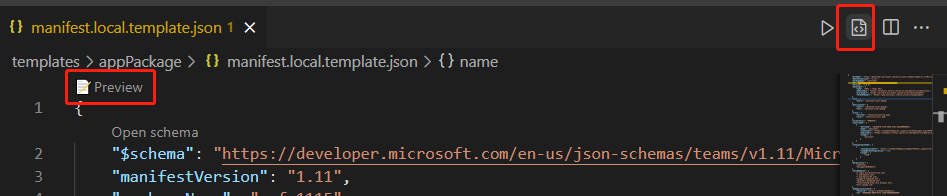

# <a name="preview-teams-app-manifest-in-teams-toolkit"></a>アプリTeamsマニフェストをプレビュー Teams Toolkit

スキャフォールディングの後、フォルダーの下に 2 つのマニフェスト テンプレート ファイルを取得 `templates/appPackage` します。

- `manifest.local.template.json` - ローカル デバッグ チーム アプリ。
- `manifest.remote.template.json` - すべてのリモート環境間で共有されます。

これらのテンプレート ファイルには、いくつかのプレースホルダーが含まれます。また、Teams Toolkitの実際の値は、以下のファイルおよび `.fx/configs` `.fx/states` .

## <a name="prerequisite"></a>前提条件

* [バージョン Teams Toolkit](https://marketplace.visualstudio.com/items?itemName=TeamsDevApp.ms-teams-vscode-extension) v3.0.0 以上をインストールします。

> [!TIP]
> VS コードで開Teamsアプリ プロジェクトを既に持っている必要があります。

## <a name="preview-manifest"></a>プレビュー マニフェスト

実際のコンテンツでマニフェストをプレビューするには、Teams Toolkit下にプレビュー マニフェスト ファイルを生成 `build/appPackage` します。

```text
└───build
    └───appPackage
        ├───appPackage.{env}.zip - Zipped app package of remote teams app
        ├───appPackage.local.zip - Zipped app package of local team app
        ├───manifest.{env}.json  - Previewed manifest of remote teams app
        └───manifest.local.json  - Previewed manifest of local teams app
```

### <a name="local-debug-teams-app"></a>ローカル デバッグ Teams アプリ

ローカル チーム アプリのマニフェスト ファイルをプレビューするには、 **まず F5** キーを押してローカル デバッグを実行する必要があります。 この手順では、既定のローカル設定が生成され、アプリ パッケージとプレビュー マニフェストが **ビルド/appPackage フォルダーの下に構築** されます。

その他の方法は次のとおりです。

- **manifest.local.template.json** ファイルの codelens で [プレビュー] を選択します。 
- **manifest.local.template.json** ファイルのメニュー バーで [マニフェスト ファイルのプレビュー] を選択します。 
- Treeview **で [zip Teamsメタデータ** パッケージ] を選択し、[ローカル] を選択します。次の図に示すように、ローカルプレビューが表示されます。



### <a name="remote-environment"></a>リモート環境

リモート チーム アプリのマニフェスト ファイルをプレビューするには、Teams Toolkit 拡張機能 Treeview の開発パネルでクラウドで [プロビジョニング] を選択するか、[Teams: コマンド パレットからクラウドでプロビジョニングする] を最初にトリガーする必要があります。   この手順では、リモート チーム アプリの構成が生成され、アプリ パッケージとプレビュー マニフェストが **ビルド/appPackage フォルダーの下に構築** されます。

その他の方法は次のとおりです。

- **manifest.remote.template.json ファイルの codelens で [プレビュー] を選択** します。 
- **manifest.remote.template.json** ファイルのメニュー バーで [マニフェスト ファイルのプレビュー] を選択します。 
- Treeview **でTeamsメタデータ パッケージの Zip** ファイルを選択し、環境を選択します。


> 複数の環境がある場合は、イメージに示すようにプレビューする env を選択する必要があります。


## <a name="sync-local-changes-to-dev-portal"></a>ローカルの変更を Dev Portal に同期する

マニフェスト ファイルをプレビューした後、次の方法でローカルの変更を Dev Portal に同期できます。

- [**更新] をTeamsの左上** 隅にある [プラットフォームの更新] を選択します。`manifest.{env}.json`
- **[Teams: マニフェストを更新して、Teamsの** メニュー バーでプラットフォームに更新します。`manifest.{env}.json`
- トリガー **Teams: コマンド パレットからTeamsプラットフォームにマニフェスト** を更新する


 

> [!NOTE]
> エディター の codelens または title ボタンからトリガーすると、現在のマニフェスト ファイルが新しいプラットフォームTeamsされます。 コマンド パレットからトリガーするには、ターゲット環境を選択する必要があります。

構成ファイルの変更またはテンプレートの変更によりマニフェスト ファイルが古くなった場合、ユーザーはアクションの確認を求めるメッセージが表示 

- **プレビューのみ**: ローカル マニフェスト ファイルは、現在の構成に従って上書きされます
- **プレビューと更新**: ローカル マニフェスト ファイルは、現在の構成に従って上書きされ、同時に Teams プラットフォームに更新されます
- **キャンセル**: 何もしない

> [!NOTE]
> 変更は開発ポータルに更新されます。 開発ポータルでいくつかの手動更新プログラムがある場合は、上書きされます。

## <a name="see-also"></a>関連項目

> [!div class="nextstepaction"]
> [アプリ マニフェストTeamsのカスタマイズTeams Toolkit](TeamsFx-manifest-customization.md)
