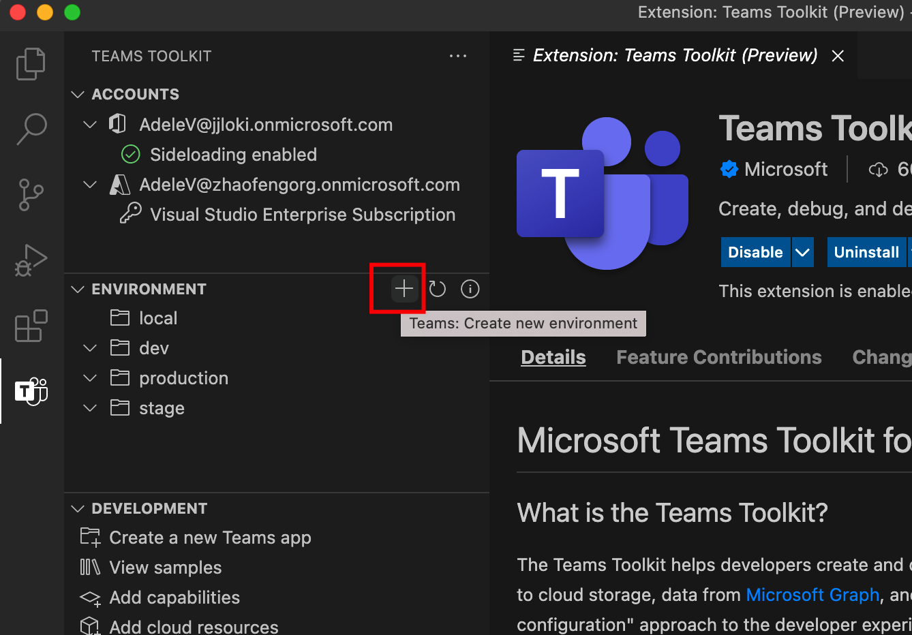

# <a name="manage-multiple-environments-in-teams-toolkit"></a>複数の環境を管理Teams Toolkit

 Teams Toolkitは、開発者が複数の環境を作成および管理し、成果物を準備し、Teamsします。

 複数の環境を使用すると、開発者は次の処理を実行できます。

1. **運用前のテスト**: 最新のアプリ開発ライフサイクルで Teams App を実稼働環境に公開する前に、複数の環境 (開発、テスト、ステージング) をセットアップする一般的な方法です。

2. **さまざまな環境で** アプリの動作を管理する : 開発者は、開発者が実稼働環境でテレメトリを有効にし、開発環境で無効にしたい場合など、さまざまな環境に対して異なる動作を設定できます。

## <a name="prerequisite"></a>前提条件

* [バージョン Teams Toolkit](https://marketplace.visualstudio.com/items?itemName=TeamsDevApp.ms-teams-vscode-extension) v3.0.0 以上をインストールします。

>[!TIP]
> VS コードで開Teamsアプリ プロジェクトを既に持っている必要があります。

## <a name="create-a-new-environment"></a>新しい環境を作成する

新しいプロジェクトを作成した後、既定Teams Toolkit作成されます。

- ローカル `local` コンピューター環境構成を表す 1 つの環境。
- リモート `dev` /クラウド環境構成を表す 1 つの環境。

> [!NOTE]
> 各プロジェクトには、1 つの環境しか `local` 使用できませんが、複数のリモート環境を使用できます。

別のリモート環境を追加するには、サイドバーの [Teams] アイコンを選択し、[環境] セクションの [プラス] ボタンをクリックし、次の図に示すように質問に従って作成します。



> [!NOTE]
> 複数の既存の環境がある場合は、環境を作成するために既存の環境を選択する必要があります。 このコマンドは、選択した既存の環境のファイルの内容とファイルの内容を、作成中の `config.<newEnv>.json` `azure.parameters.<newEnv>.json` 新しい環境にコピーします。

## <a name="select-target-environment"></a>ターゲット環境の選択 

環境に関する概念Teams Toolkit、すべての環境関連の操作に対して、操作を実行する対象の環境を選択できます。 次の図に示すように、複数のリモート環境がある場合、ツールキットはターゲット環境の確認と要求を行います。


## <a name="project-folder-structure"></a>Projectフォルダー構造 

プロジェクトを作成した後は、プロジェクト フォルダーとファイルをプロジェクト フォルダーの [エクスプローラー] 領域Visual Studio Code。 カスタム コードの他に、アプリの構成、状態Teams Toolkitテンプレートを維持するために、一部のファイルが使用されます。 次に、これらのファイルの一覧を示し、複数の環境との関係を概説します。

- `.fx/configs`: ユーザーがアプリ用にカスタマイズできる構成ファイルTeamsします。
  - `config.<envName>.json`: 環境ごとの構成ファイル。
  - `azure.parameters.<envName>.json`: Azure BICEP プロビジョニング用の環境ごとのパラメーター ファイル。
  - `projectSettings.json`: すべての環境に適用されるグローバル プロジェクト設定。
  - `localSettings.json`: ローカル デバッグ構成ファイル。
- `.fx/states`: ユーザーが生成するプロビジョニング結果Toolkit。
  - `state.<envName>.json`: 環境ごとのプロビジョニング出力ファイル。
  - `<env>.userdata`: プロビジョニング出力の環境ごとの機密ユーザー データ。
- `templates`
  - `appPackage`: アプリ マニフェスト テンプレート ファイル。
  - `azure`: BICEP テンプレート ファイル。

## <a name="customize-the-provision"></a>プロビジョニングをカスタマイズする 

Teams Toolkit構成ファイルとテンプレート ファイルを変更して、各環境でリソースの準備をカスタマイズできます。

次の表に、カスタマイズされたプロビジョニングでサポートされる一般的なシナリオとカスタマイズする場所を示します。

| シナリオ | カスタマイズする場所 | カスタマイズする方法 |
| --- | --- | --- |
| Azure リソースのカスタマイズ | <ul> <li>BICEP ファイルの下 `templates/azure` にある .</li> <li>`.fx/azure.parameters.<envName>.json`.</li></ul> | 詳細については [、「ARMテンプレートをカスタマイズする](provision.md#customize-arm-parameters-and-templates) 」を参照してください。 |
| アプリの既存AAD再利用Teamsする | <ul> <li>`auth`セクション `.fx/config.<envName>.json`</li> </ul> | 詳細については[、「既存のアプリをAADアプリTeams使用する](provision.md#use-an-existing-aad-app-for-your-teams-app)」を参照してください。 |
| ボット用の既存AADアプリを再利用する | <ul> <li>`bot`セクション `.fx/config.<envName>.json`</li> </ul> | 詳細については[、「ボットに既存AADアプリを使用する](provision.md#use-an-existing-aad-app-for-your-bot)」を参照してください。 |
| プロビジョニング時にユーザーの追加をスキップSQL | <ul> <li>`skipAddingSqlUser`のプロパティ `.fx/config.<envName>.json`</li> </ul> | 詳細については[、「ユーザーの追加をSQL」](provision.md#skip-adding-user-for-sql-database)を参照してください。 |
| アプリ マニフェストのカスタマイズ | <ul> <li>`templates/manifest.remote.template.json`.</li> <li>`manifest`セクション `.fx/config.<envName>.json`</li>  </ul> | 詳細については[、「Teamsアプリ マニフェストのカスタマイズ」Teams Toolkit](TeamsFx-manifest-customization.md)参照してください。 |

## <a name="scenarios"></a>シナリオ

### <a name="scenario-1-customize-teams-app-name-for-different-environment"></a>シナリオ 1: さまざまな環境Teamsアプリ名をカスタマイズする

この例では、既定の環境とステージング環境Teamsアプリ名を設定する `myapp(dev)` `dev` `myapp(staging)` 方法について説明します `staging` 。

カスタマイズの手順に従います。

- 手順 1: 構成ファイルを開きます `.fx/configs/config.dev.json` 。
- 手順 2: マニフェストのプロパティを *appName >短>に更新* する `myapp(dev)`

  更新プログラム `.fx/configs/config.dev.json` :

  ```json
  {
      "$schema": "https://aka.ms/teamsfx-env-config-schema",
      "description": "You can customize the TeamsFx config for different environments.   Visit https://aka.ms/teamsfx-env-config to learn more about this.",
      "manifest": {
          "appName": {
              "short": "myapp(dev)"
              ...
          }
      }
      ...
  }
  ```

- 手順 3: 存在しない場合という名前 `staging` の新しい環境を作成します。
- 手順 4: 構成ファイルを開きます `.fx/configs/config.staging.json` 。
- 手順 5: 手順 2 の同じプロパティを更新します `myapp(staging)` 。
- 手順 6: プロビジョニング コマンドと環境 `dev` を実行 `staging` して、リモート環境でアプリ名を更新します。 プロビジョニング コマンドを実行する方法については、Teams Toolkit。 詳細については、このドキュメント [を参照してください](provision.md#provision-using-teams-toolkit)。

### <a name="scenario-2-customize-teams-app-description-for-different-environment"></a>シナリオ 2: さまざまな環境Teamsアプリの説明をカスタマイズする

このシナリオでは、さまざまな環境に対して異なるアプリTeamsを設定する方法について説明します。

- 既定の環境の `dev` 場合、説明は次になります `my app description for dev` 。
- ステージング環境の `staging` 場合、説明は次になります `my app description for staging` 。

カスタマイズを実行する手順:

- 手順 1: 構成ファイルを開きます `.fx/configs/config.dev.json` 。
- 手順 2: マニフェストの新しいプロパティを *追加し>値>短く* します `my app description for dev` 。

  更新プログラム `.fx/configs/config.dev.json`

  ```json
  {
      "$schema": "https://aka.ms/teamsfx-env-config-schema",
      "description": "You can customize the TeamsFx config for different environments.   Visit https://aka.ms/teamsfx-env-config to learn more about this.",
      "manifest": {
          ...
          "description": {
              "short": "`my app description for dev"
              ...
          }
      }
      ...
  }
  ```

- 手順 3: 存在しない場合という名前 `staging` の新しい環境を作成します。
- 手順 4: 構成ファイルを開きます `.fx/configs/config.staging.json` 。
- 手順 5: 手順 2 の同じプロパティをに追加します `my app description for staging` 。
- 手順 6: リモート用Teamsマニフェスト テンプレートを開きます `templates/appPackage/manifest.remote.template.json` 。
- 手順 7: 構成ファイルで定義されている変数を口ひげ構文で使用する `description > short` プロパティを更新します `{{config.manifest.description.short}}` 。
  
  更新プログラム `manifest.remote.template.json` :

  ```json
  {
    "$schema": "https://developer.microsoft.com/en-us/json-schemas/teams/v1.11/MicrosoftTeams.schema.json",
    "manifestVersion": "1.11",
    "version": "1.0.0",
    ...
    "description": {
      "short": "{{config.manifest.description.short}}",
      ...
    },
    ...
  }
  ```
- 手順 8: プロビジョニング コマンドと環境 `dev` を実行 `staging` して、リモート環境でアプリ名を更新します。 プロビジョニング コマンドを実行する方法については、Teams Toolkitこの[ドキュメントを参照](provision.md#provision-using-teams-toolkit)してください。

### <a name="scenario-3-customize-teams-app-description-for-all-environments"></a>シナリオ 3: すべてのTeamsアプリの説明をカスタマイズする

このシナリオでは、アプリの説明をすべての環境にTeamsする `my app description` 方法について説明します。

アプリ マニフェスト Teamsテンプレートがすべての環境で共有されている場合、ターゲットの説明の値を更新できます。

- 手順 1: リモート用Teamsマニフェスト テンプレートを開きます `templates/appPackage/manifest.remote.template.json` 。
- 手順 2: ハードコードされた `description > short` 文字列で **プロパティを更新します** `my app description` 。
  
  更新プログラム `manifest.remote.template.json` :

  ```json
  {
    "$schema": "https://developer.microsoft.com/en-us/json-schemas/teams/v1.11/MicrosoftTeams.schema.json",
    "manifestVersion": "1.11",
    "version": "1.0.0",
    ...
    "description": {
      "short": "my app description",
      ...
    },
    ...
  }

- Step 3: run provision command against **all** environment to update the app name in remote environments. For how to run provision command with Teams Toolkit, you can refer to [this document](provision.md#provision-using-teams-toolkit) for more details.

### Scenario 4: customize Azure resources for different environment

You can customize Azure resources for each environment, for example specifying Azure Function name, by editing the environment corresponding `.fx/configs/azure.parameters.{env}.json` file.

For more information on BICEP template and parameter files, see [provision cloud resources](provision.md)

## See also

> [!div class="nextstepaction"]
> [Provision cloud resources](provision.md)

> [!div class="nextstepaction"]
> [Add more cloud resources](add-resource.md)

> [!div class="nextstepaction"]
> [Collaborate with other developers on Teams project](TeamsFx-collaboration.md)
