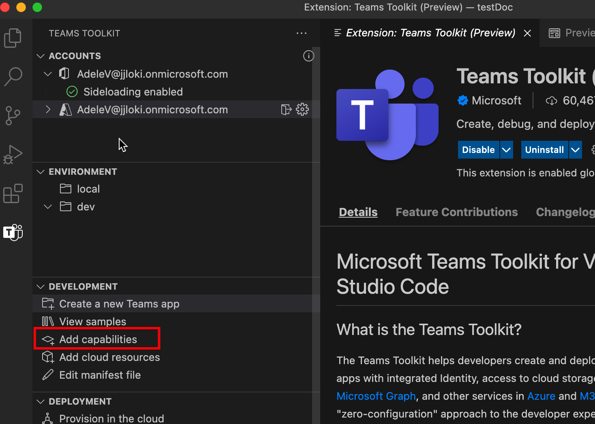
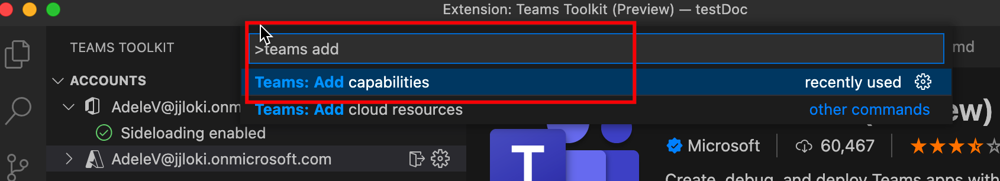

# アプリに機能をTeamsする

アプリの機能の 1 つでTeamsアプリを作成Teams開始できます。 アプリの開発中は、Teams Toolkitを使用して、アプリに柔軟にTeamsできます。 次の表に、アプリのTeams説明します。

|**機能**|**説明**|
|--------|-------------|
| タブ |  タブは、アプリ マニフェストで宣言されたドメインを指す単純な HTML タグです。 個々のユーザーのチーム、グループ チャット、または個人用アプリ内のチャネルの一部としてタブを追加できます。|
| ボット |  ボットは、テキスト、対話型カード、タスク モジュールを介して Web サービスと対話するのに役立ちます。|
| メッセージング拡張機能 | メッセージング拡張機能は、Web サービスと対話するために、クライアント内のボタンとフォームMicrosoft Teamsします。|

## 前提条件

* [バージョン Teams Toolkit](https://marketplace.visualstudio.com/items?itemName=TeamsDevApp.ms-teams-vscode-extension) v3.0.0 以上をインストールします。

> [!TIP]
> VS コードで開Teamsアプリ プロジェクトを既に持っている必要があります。

## アプリケーションを使用して機能をTeams Toolkit

> [!IMPORTANT]
> アプリに機能を正常に追加した後、各環境に対してプロビジョニングをTeamsがあります。

1. 左側 **のTeams Toolkit** を選択します。

    
  
1. [機能 **の追加] を選択します**。

    

      コマンド パレットを開き、[機能の追加] Teams **入力することもできます**。 
      
      > [!NOTE]
      > これはツリー ビューからのトリガーと同等です。

    

1. ポップアップから、プロジェクトに含める機能を選択します。

    

1. **[OK]** を選択します。

選択した機能は、プロジェクトに完全に追加されます。 このTeams Toolkit新しく追加された機能のソース コードを生成します。

## コマンド ウィンドウで TeamsFx CLI を使用して機能を追加する

1. ディレクトリをプロジェクト ディレクトリ **に変更します**。
1. 次のコマンドを実行して、プロジェクトにさまざまな機能を追加します。

   |機能とシナリオ| コマンド|
   |-----------------------|----------|
   |タブを追加するには|`teamsfx capability add tab`|
   |ボットを追加するには|`teamsfx capability add bot`|
   |メッセージング拡張機能を追加するには|`teamsfx capability add messaging-extension`|

## サポートされる機能のマトリックス

アプリが既に持Teams機能とは別に、アプリにさまざまな機能を追加Teamsできます。次の表に、さまざまなサポートされているアプリTeams示します。 

|既存の機能|その他の機能を追加できます|
|--------------------|--------------------|
|タブとSPFx|なし|
|Azure のタブ|ボットとメッセージング拡張機能|
|ボット|タブ|
|メッセージングの拡張機能|タブ|
|タブとボット|なし|
|タブとメッセージング拡張機能|なし|
|タブ、ボット、メッセージング拡張機能|なし|

## 機能を追加するとどうなるか

ボットとメッセージング拡張機能を追加した後、プロジェクトで次の変更を行います。

- ボット テンプレート コードがパスを持つサブフォルダーに追加されます `yourProjectFolder/bot` 。 これには、プロジェクトに "hello world" ボット アプリケーション テンプレートが含まれます。
- `launch.json` フォルダー `task.json` `.vscode` の下が更新されます。 これには、アプリケーションをローカルでVisual Studio Codeするときに実行されるアプリケーションに必要なスクリプトが含まれます。 
- `manifest.remote.template.json` フォルダー `manifest.local.template.json` の下 `templates/appPackage` のファイルが更新されます。 これには、アプリケーションを表すマニフェスト ファイル内のボット関連情報が含まれます。Teamsします。 この変更には、次の内容が含まれます。
  - ボットの ID。
  - ボットのスコープ。
  - hello world ボット アプリケーションが応答できるコマンド。
- 下の `templates/azure/teamsfx` ファイルが更新され、テンプレート/azure/provision/xxx.bicep ファイルが再生成されます。
- 下のファイル `.fx/config` が再生成されます。 これにより、新しく追加された機能の適切な構成でプロジェクト セットが保証されます。

タブを追加すると、プロジェクトの次の変更点が変更されます。

- フロントエンド タブ テンプレート コードが、パスを持つサブフォルダーに追加されます `yourProjectFolder/tab` 。 これには、プロジェクトに "hello world" タブ アプリケーション テンプレートが含まれます。
- `launch.json` フォルダー `task.json` `.vscode` の下が更新されます。 これには、アプリケーションをローカルでVisual Studio Codeするときに実行されるアプリケーションに必要なスクリプトが含まれます。 
- `manifest.remote.template.json` フォルダー `manifest.local.template.json` の下 `templates/appPackage` のファイルが更新されます。 これには、マニフェスト ファイル内のタブ関連の情報が含まれます。この変更には、Teamsプラットフォーム内のアプリケーションを表します。
  - 構成可能なタブと静的タブ。
  - タブの範囲。
- 下の `templates/azure/teamsfx` ファイルが更新され、テンプレート/azure/provision/xxx.bicep ファイルが再生成されます。
- 下のファイル `.fx/config` が再生成されます。 これにより、新しく追加された機能の適切な構成でプロジェクト セットが保証されます。

## 制限事項

現在、他の機能を追加する場合、TeamsFx には制限があります。 制限は次のとおりです。

- 各プロジェクトの機能が 2 回以上
- タブ アプリケーションを使用して開始する場合は、すべての機能SPFx
- プロジェクトにメッセージング拡張機能が含まれている場合のボット機能の追加
- プロジェクトにボットが含まれている場合、その他のメッセージング拡張機能。

> [!NOTE]
> ボットとメッセージング拡張機能の両方の機能を含める場合は、それらを同時に選択します。 新しいプロジェクトまたはタブ アプリケーションを作成するときに追加できます。

## 関連項目

> [!div class="nextstepaction"]
> [クラウド リソースのプロビジョニング](provision.md)

> [!div class="nextstepaction"]
> [新しいプロジェクトTeamsする](create-new-project.md)
