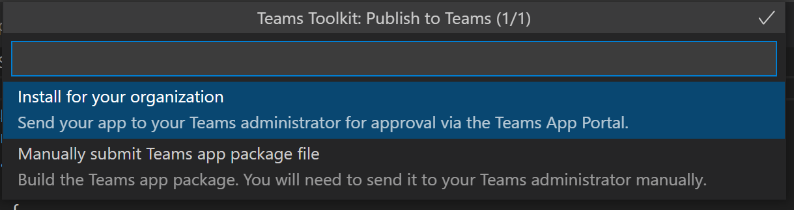

# Teams ツールキットを使用して Teams アプリを公開する

アプリを作成した後は、個人、チーム、組織、すべてのユーザーなど、さまざまなスコープにアプリを配布できます。 分布は、ニーズ、ビジネス要件、技術要件、アプリの目標など、複数の要因によって異なります。 異なるスコープへの配布には、異なるレビュー プロセスが必要な場合があります。 一般に、スコープが大きいほど、セキュリティとコンプライアンスに関する懸念のためにアプリが通過する必要があるレビューが多くなります。

## 前提条件

* [Teams ツールキット バージョン v3.0.0+ をインストール](https://marketplace.visualstudio.com/items?itemName=TeamsDevApp.ms-teams-vscode-extension)します。

> [!TIP]
> VS コードに Teams アプリ プロジェクトがあることを確認します。

## 個々のスコープまたはサイドロード アクセス許可に発行する

ユーザーは、アプリ パッケージ (.zip ファイル) をチームに直接アップロードするか、個人的なコンテキストでアップロードすることにより、カスタム アプリを Teams に追加できます。 アプリ パッケージをアップロードしてカスタム アプリを追加することはサイドローディングと呼ばれ、開発中にアプリをテストできます。アプリは、次のシナリオで説明したように、広く配布する準備が整う前に行うことができます。

* アプリをローカルでテストしてデバッグします。
* ワークフローを自動化するために、自分用のアプリを構築しました。
* 作業グループなど、少数のユーザー向けのアプリを作成しました。

社内専用のアプリを作成し、Teams アプリ ストアの Teams アプリ カタログに送信せずにチームと共有することもできます。

**アプリを *.zip アプリ パッケージフ ァイル** にビルドするには

Teams ツールキットの Treeview で **DEPLOYMENT** から `Zip Teams metadata package` を選択すると、アプリ パッケージをビルドできます。 最初に `Provision in the cloud` を実行する必要があります。 生成されたアプリ パッケージは `{your project folder}/build/appPackage/appPackage.{env}.zip` にあります。

アプリ パッケージをアップロードするには、次の手順を実行します。

1. Teams クライアントで、左側のバーで **[アプリ]** を選択します。
2. **[アプリの管理]** を選択します。
3. **[アプリの発行] を選択します**。

   :::image type="content" source="../assets/images/teams-toolkit-v2/teams toolkit fundamentals/pub.png" alt-text="publish":::

4. **[カスタム アプリをアップロードする]** を選択します。

   :::image type="content" source="../assets/images/teams-toolkit-v2/teams toolkit fundamentals/uplo.png" alt-text="アップロード":::

## 組織にアプリを公開する

アプリを本番環境で使用する準備ができたら、Teams ツールキットとともにインストールされた Microsoft Visual Studio Code などの統合開発環境 (IDE) である Graph API から呼び出される Teams アプリ送信 API を使用してアプリを送信できます。 Teams ツールキットの TreeView の **[展開]** から **[Teams に公開]** を選択するか、コマンドパレットから **[Teams: Teams に公開]** をトリガーすることができます。 次に、**[組織用にインストール]** を選択します。

このアプリは、Microsoft Teams 管理センターの **[アプリの管理]** で利用できます。ここで、ユーザーと管理者は、アプリを確認して承認できます。

[Microsoft Teams 管理センター](https://admin.teams.microsoft.com/policies/manage-apps)の **[アプリの管理]** は、管理者が組織用のすべての Teams アプリを表示および管理できる場所です。 アプリの組織レベルでの状態とプロパティの確認、組織のアプリ ストアへの新しいカスタム アプリの承認またはアップロード、組織レベルでのアプリのブロックまたは許可、チームへのアプリの追加、サードパーティ製アプリのサービスの購入、アプリによって要求されたアクセス許可の表示、アプリに対する管理者の同意の付与、[組織全体のアプリ設定の管理を行う](https://admin.teams.microsoft.com/policies/manage-apps)ことができます。

Teams アプリ申請 API の上に構築されたVisual Studio Code 用ツールキットを使用すると、Teams 上のカスタム アプリの申請から承認へのプロセスを自動化できます。

> [!NOTE]
> アプリはまだ組織のアプリ ストアに発行されません。 この手順では、アプリを Microsoft Teams 管理センターに送信し、組織のアプリ ストアへの発行を承認できます。

## Teams アプリの管理者承認

その後、Teams テナントの管理者は、Microsoft Teams管理センターの **[アプリの管理]** に移動し、左側のナビゲーションで [アプリの管理] > [Teams アプリ] に移動します。 組織のすべての Teams アプリを表示できます。 ページの上部にある [承認の保留中] ウィジェットでは、承認のためにカスタム アプリがいつ送信されたのかがわかります。
この表では、新しく送信されたアプリによって、送信されたアプリとブロックされたアプリの状態が自動的に発行されます。 発行状態列を降順で並べ替えて、アプリを見つけることができます。

 :::image type="content" source="../assets/images/teams-toolkit-v2/teams toolkit fundamentals/admin-approval-for-teams-app-1.png" alt-text="承認":::

アプリ名を選択して、アプリの詳細ページに移動します。 [詳細情報] タブでは、説明、ステータス、アプリ ID など、アプリに関する詳細情報を確認できます。

 :::image type="content" source="../assets/images/teams-toolkit-v2/teams toolkit fundamentals/about-submitted-app-1.png" alt-text="送信されたアプリ":::

アプリを発行するには、次の手順に従います。

1. Microsoft Teams 管理センターの左側のナビゲーションで、[Teams アプリ] > **[アプリの管理]** の順に移動します。
2. アプリ名を選択してアプリの詳細ページに移動し、状態ボックスで **[発行]** を選択します。
アプリを公開すると、[公開ステータス] が [公開済み] に変わり、[ステータス] が自動的に [許可] に変わります。

## Microsoft Teams ストアにアプリを発行する

アプリを Microsoft Teams 内のストアに直接配布して、世界中の何百万ものユーザーにリーチできます。 アプリがストアでも紹介されている場合は、潜在的な顧客に即座にリーチできます。 Teams ストアに公開されたアプリは、Microsoft 365 アプリおよびソリューションの公式マーケットプレイスである Microsoft AppSource にも自動的に一覧表示されます。

詳細については、「([Microsoft Teams ストアにアプリを発行する](../concepts/deploy-and-publish/appsource/publish.md#publish-your-app-to-the-microsoft-teams-store))」を参照してください。

## 関連項目

* [複数の環境を管理する](TeamsFx-multi-env.md)
* [Teams プロジェクトで他の開発者と協力する](TeamsFx-collaboration.md)
