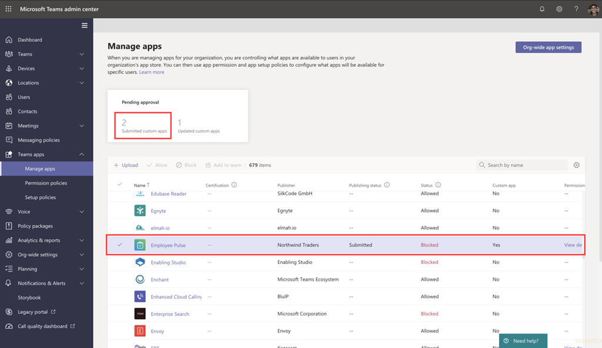

# アプリをTeamsしてアプリをTeams Toolkit

アプリを作成した後、アプリを個別、チーム、組織、またはだれでもなど、さまざまなスコープに配布できます。 この配布は、ニーズ、ビジネス要件、技術的要件、アプリの目標など、複数の要因に依存します。 異なる範囲への配布には、異なるレビュー プロセスが必要な場合があります。 一般に、スコープが大きかった場合は、セキュリティとコンプライアンスの懸念のためにアプリを確認する必要があります。

## 前提条件

* [バージョン Teams Toolkit](https://marketplace.visualstudio.com/items?itemName=TeamsDevApp.ms-teams-vscode-extension) v3.0.0 以上をインストールします。

> [!TIP]
> アプリ プロジェクトは既にTeams必要があります。

## 個々のスコープに発行する (サイドローディングのアクセス許可)

ユーザーは、Teams ファイルにアプリ パッケージを直接アップロードするか、.zipコンテキストでアプリ パッケージをアップロードすることで、カスタム アプリをアプリに追加できます。 サイド ローディングとも呼ばれるアプリ パッケージをアップロードしてカスタム アプリを追加すると、次のシナリオで説明したように広く配布する準備が整う前に、開発中のアプリをテストできます。

* 自分または他の開発者と一緒にアプリをローカルでテストしてデバッグします。
* 自分だけのアプリを構築しました。 たとえば、ワークフローを自動化します。
* 作業グループなどの小さなユーザー セット用のアプリを構築しました。

また、内部使用専用のアプリを構築し、チームと共有して、Teams アプリ ストアの Teams カタログに送信することもできます。

* アプリを *.zip パッケージ ファイルにビルドする

    アプリ パッケージをビルドするには、アプリ のツリービューの [展開] パネル `Zip Teams metadata package` から選択Teams Toolkit。 最初に実行する必要 `Provision in the cloud` がある場合があります。 生成されたアプリ パッケージは、次の `{your project folder}/build/appPackage/appPackage.{env}.zip` 図に示すように表示されます。

 

## 組織にアプリを公開する 

アプリを実稼働環境で使用する準備ができたら、開発者は Graph ツールキットと一緒にインストールされた Visual Studio Code などの統合開発環境 (IDE) である Graph API から呼び出される Teams Teams アプリ申請 API を使用してアプリを提出できます。 [ツリー ビュー オブ Teams Toolkit]**の [** 展開] Teamsから [発行] を選択するか、[Teams: コマンド パレットTeamsに発行]**を** トリガーします。 次の **図に示すように、[組織の** インストール] を選択します。

これにより、管理センターの [アプリの管理] ページでアプリを使用Microsoft Teams管理者が確認および承認できます。

管理者は、管理センターの [アプリの管理] ページMicrosoft Teams、組織のすべてのアプリを表示Teams管理します。 ここでは、アプリの組織レベルの状態とプロパティを確認したり、組織のアプリ ストアに新しいカスタム アプリを承認またはアップロードしたり、組織レベルでアプリをブロックまたは許可したり、チームにアプリを追加したり、サードパーティアプリのサービスを購入したり、アプリから要求されたアクセス許可を表示したり、アプリに管理者の同意を与え、組織全体のアプリ設定を管理することができます。

Teams アプリ申請 API の上に構築された Visual Studio Code 用チーム管理センター [Teams](https://admin.teams.microsoft.com/policies/manage-apps)ツールキットでアプリ ページを管理し、Teams のカスタム アプリの承認申請プロセスを自動化できます。

> [!NOTE]
> これにより、組織のアプリ ストアにアプリがまだ発行されていないことに気を付ける必要があります。 この手順では、アプリを組織Microsoft Teamsストアに発行することを承認できる管理者センターにアプリを送信します。

## 送信されたアプリの管理者Teams承認

Teams テナントの管理者は、Microsoft Teams 管理センターの [アプリの管理] ページ (左側のナビゲーションで、[Teams アプリ> アプリの管理] に移動して、組織のすべての Teams アプリを表示できます。 ページの上部にある保留中の承認ウィジェットを使用すると、カスタム アプリが承認のために送信される時間を確認できます。
表の中で、新しく送信されたアプリは自動的に発行の状態が [送信済み] と [状態] の [ブロック済み] と表示されます。 [発行状態] 列を降順に並べ替え、アプリをすばやく検索できます。

 

アプリ名を選択して、アプリの詳細ページに移動します。 [概要] タブでは、アプリの詳細 (説明、状態、提出者、アプリ ID など) を表示できます。

 

アプリをユーザーが利用できる状態にした場合は、次の手順に従ってアプリを発行します。

1. 管理センターの左側のナビゲーションMicrosoft Teams、[アプリの管理] Teams[>] に移動します。
2. アプリ名を選択してアプリの詳細ページに移動し、[発行の状態] ボックスで [発行] を選択します。
アプリを発行すると、[発行] 状態が [発行済み] に変更され、[状態] が [許可済み] に自動的に変更されます。

## [ファイルに発行Microsoft Store

アプリをアプリ内のストアに直接配布Microsoft Teams世界中の何百万人ものユーザーにリーチできます。 アプリがストアでも機能している場合は、潜在的な顧客に即座にアクセスできます。
また、Teams ストアに発行されたアプリは、Microsoft AppSource に自動的に一覧表示されます。これは、アプリとソリューションのMicrosoft 365マーケットプレースです。
発行プロセスを理解する アプリの準備が整ったと感じたら、アプリをストアに表示するプロセスをTeamsできます。

>[!Tip]
> 提出前の手順を密接に実行すると、Microsoft がアプリの発行を承認する可能性が高い可能性があります。

* アプリがTeamsとストアの標準を満たTeams、ストアの検証ガイドラインを確認します。
* パートナー センターの開発者アカウントを作成します。
* 自動テストの実行、テスト ノートのコンパイル、ストア登録情報の作成など、レビュー プロセスを迅速化するための重要なタスクを含む、ストア申請を準備します。
* パートナー センターからアプリを提出します。
* Microsoft と直接作業して問題を解決し、アプリを再送信します (問題を解決し、アプリを再送信するためのリンク)。

## 関連項目

> [!div class="nextstepaction"]
> [複数の環境を管理する](TeamsFx-multi-env.md)

> [!div class="nextstepaction"]
> [プロジェクトで他の開発者とTeamsする](TeamsFx-collaboration.md)