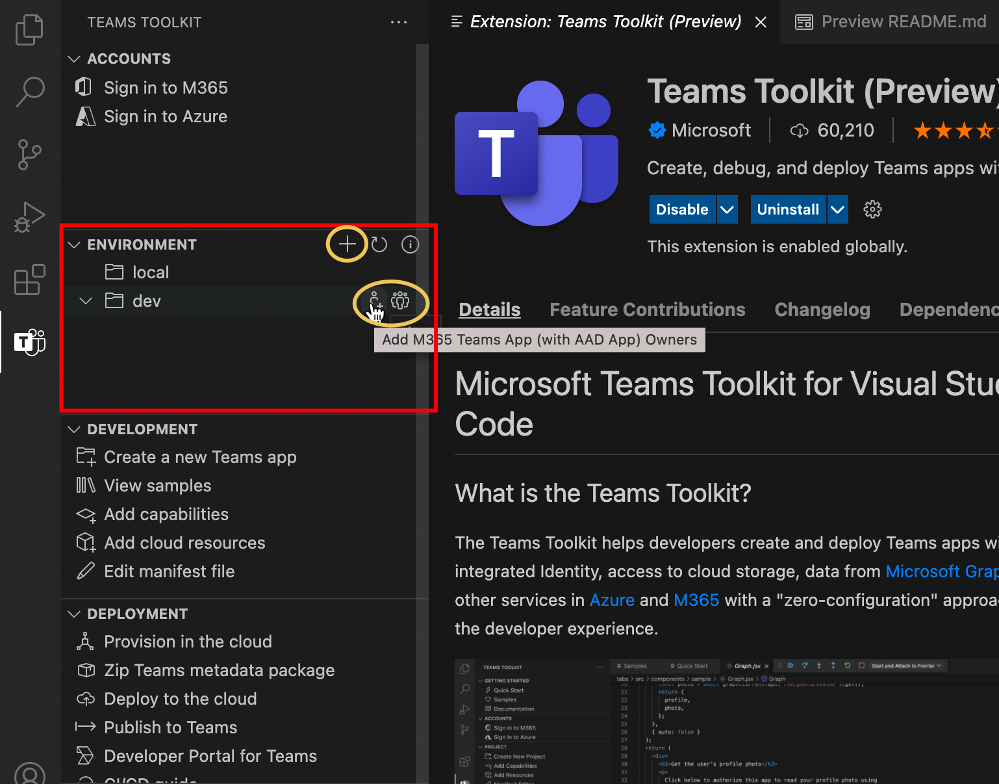

# Teams Toolkit

> [!NOTE]
> 現時点では、この機能はパブリック開発者 **プレビューでのみ利用** できます。

Teams Toolkit Visual Studio Code を使用すると、開発者は、統合 ID、クラウド ストレージへのアクセス、Microsoft Graph からのデータ、Azure および Microsoft 365 の他のサービスを備えた Teams アプリを作成および展開し、開発者エクスペリエンスに対するゼロ構成アプローチを使用できます。  

アプリ開発用Teams Toolkit、Visual Studio[開発用の CLI](https://github.com/OfficeDev/TeamsFx/blob/dev/docs/cli/user-manual.md)ツール (Teams) があります `teamsfx` 。

## インストール用のTeams ToolkitをインストールVisual Studio Code

1. [ファイル **Visual Studio Code] を開きます。**

1. [拡張機能] ビューを選択します **(Ctrl + Shift +**  /   **>** X

1. 検索ボックスに「Teams Toolkit」**と入力します**。

1. [インストール **] ボタン** の横にある [インストール] Teams Toolkit。

または、マーケットプレースでTeams ToolkitをVisual Studio Code[できます](https://marketplace.visualstudio.com/items?itemName=TeamsDevApp.ms-teams-vscode-extension)。

## アプリTeamsサポート

[Microsoft Teams機能は、Teams](../concepts/capabilities-overview.md)機能拡張ポイントです。TeamsToolkitのVisual Studio Codeは、開発者が次のアプリ機能を使用してプロジェクトをTeamsサポートしています。

* [タブ](../tabs/what-are-tabs.md#microsoft-teams-tabs)

* [ボット](../bots/what-are-bots.md#bots-in-microsoft-teams)

* [メッセージング拡張機能](../messaging-extensions/what-are-messaging-extensions.md#messaging-extensions) 

プロジェクトTeams、いずれかの機能または上記の 3 つの機能のいずれかを含めできます。 アプリケーションを作成するときに、任意の機能をTeams Project。

![[新しい機能の作成] で機能を選択Project](./images/create-project-capabilities.png)

Teams Toolkitアプリ開発のさらなるプロセスで、より多くの機能を追加する柔軟性Teams提供します。

## ユーザーのTeams Toolkit

Teams Toolkitアプリ開発のTeamsを提供し、デバッグ、展開、発行を容易に行います。 Teams Toolkit作業を自動化し、リソースと Azure リソースのTeams統合します。 次の図は、ユーザー Teams Toolkitを示しています。

## ツアーに参加して、Teams ToolkitをVisual Studio Code

VS Code で Teams プロジェクトを開かない場合、または Teams Toolkit v2.+を使用して作成されていないプロジェクトを開いた場合は、次の図に示すように、機能が制限された Teams Toolkit UI が表示されます。

:::image type="content" source="./images/teams-toolkit-beforestart.png" alt-text="開始する前にTeams Toolkit":::

[クイック スタート]**を選択** してプロジェクトをTeams Toolkit、または [新しいアプリを作成 **Teams]** を選択して、1 つのプロジェクトTeamsできます。 VS Code で Teams Toolkit v2.+ によって作成された Teams Toolkit UI が表示される場合は、次の図に示すように、より多くの機能を備えた Teams Toolkit UI が表示されます。 Teams Project

:::image type="content" source="./images/teams-toolkit-overview.png" alt-text="ツアーに参加してTeams Toolkit":::

次の方法で使用できる機能のツアーをTeams Toolkit。

* [Accounts](#accounts)

* [環境](#environment)

* [開発](#development)

* [展開](#deployment)

* [ヘルプとフィードバック](#help-and-feedback)

### アカウント

開発者は、アプリをビルドMicrosoft 365アカウントを持Teamsがあります。 開発者アカウントをお持ちでない場合は、開発者Teamsプログラムに参加Microsoft 365[取得できます](https://developer.microsoft.com/microsoft-365/dev-program)。

Azure アカウントは、アプリ開発のTeams使用されます。 Azure でアプリをホストTeamsリソースにアクセスする場合は、Azure アカウントが必要です。 Teams Toolkit、Azure リソースのサインイン、プロビジョニング、および展開を行う統合エクスペリエンスをサポートします。 開始する [前に無料の Azure アカウント](https://azure.microsoft.com/free/) を作成できます。

 詳細については、「アプリをビルド[するためのアカウントの準備」をTeamsしてください。](accounts.md)

### 環境

Teams Toolkit複数の環境を管理するのに役立ちます。 環境を追加、構成、およびカスタマイズできます。 各環境に対して共同作業者を追加できます。

 詳細については、「複数の環境[を管理し、](TeamsFx-multi-env.md)プロジェクトで他の開発者とTeams[してください](TeamsFx-collaboration.md)。

### 開発

Teams Toolkitアプリ開発を簡単かつ迅速に機能Teamsアプリ プロジェクトを作成してカスタマイズTeams便利です。 

1. **新しいアプリをTeams、"hello** world" テンプレート プロジェクトまたはサンプル プロジェクトTeamsアプリ開発作業を開始するのに役立ちます。 詳細については、「Create [new Teams project」を参照してください。](create-new-project.md)
1. **サンプルを** 表示し、探索、参照、開発Teams一連のサンプル アプリを表示します。
1. **機能を追加し**、開発プロセス中TeamsいつでもTeamsアプリに別の機能を追加するのに役立ちます。 詳細については、「Add [capabilitis to your Teams」を参照してください。](add-capability.md)
1. **クラウド リソースを追加** すると、要件の変更に応じて追加のクラウド リソースを追加できます。詳細については、「アプリの [クラウド リソースを追加する」をTeamsしてください。](add-resource.md)
1. **マニフェスト ファイルの編集** を使用すると、アプリとクライアントTeams統合する方法をTeamsできます。 詳細については、「プレビュー マニフェスト ファイル[とTeamsマニフェスト](TeamsFx-manifest-preview.md)ファイル[Teamsを参照してください](TeamsFx-manifest-customization.md)。

### 展開

開発中または開発後に、ユーザーがアクセスできる前に、プロビジョニング、展開、およびTeamsを実行するプロセスに従う必要があります。

1. Azure で Teams アプリをホストする場合、または Azure リソースを使用する必要がある場合は、クラウドでのプロビジョニングを使用すると、Azure リソースを作成するプロセスを自動化できます。 それを使用するには、Azure サブスクリプションが必要です。 詳細については、「プロビジョニング クラウド リソース [」を参照してください](provision.md)。

1. アプリまたは共有を公開する前に、[Zip] メタデータ パッケージを選択して、Teamsアプリをパッケージに **Teamsできます**。

1. **クラウドに展開すると、** ソース コードを Azure に展開できます。 展開を実行する前提条件は、クラウドで Provision を実行してリソースをプロビジョニングするか、Azure リソースを手動で作成し、プロジェクトの環境設定でリソース パラメーターを指定する必要があります。 詳細については、「アプリを[クラウドにTeamsする」を参照してください](deploy.md)。

1. カスタム Teams アプリを手動で発行する代わりに、Publish to **Teams** 関数を使用して Teams api を呼び出してアプリTeamsできます。 アプリにアップロードするアクセス許可Teamsがあります。 詳細については、「アプリを[アプリに公開する」を参照Teams。](publish.md)

1. 開発者ポータルは、Teamsアプリを管理および配布できるTeamsです。詳細については、「開発者ポータル[」を参照してください。](/microsoftteams/platform/concepts/build-and-test/teams-developer-portal)

1. Teams Toolkitワークフロー、Azure Devops、Jenkins など、CI/CD ツールGitHub CI/CD テンプレートも提供しています。 詳細については、「ビルド[CI/CD パイプライン for Teams」を参照してください。](use-CICD-template.md)

### ヘルプとフィードバック

このセクションでは、必要なドキュメントとリソースを簡単に見つくことができます。 製品エキスパートから **クイック サポート** を受GitHub、Teams Toolkitで [問題の報告]**を選択** できます。 新しいタグを作成する前に問題を参照するか[、StackOverflow `teams-toolkit` タグ](https://stackoverflow.com/questions/tagged/teams-toolkit)を参照して質問を行います。

## 関連項目

> [!div class="nextstepaction"]
> [新しいプロジェクトの使用を作成Teams Toolkit](create-new-project.md)

> [!div class="nextstepaction"]
>[アプリをビルドするためのアカウントTeamsする](accounts.md)
