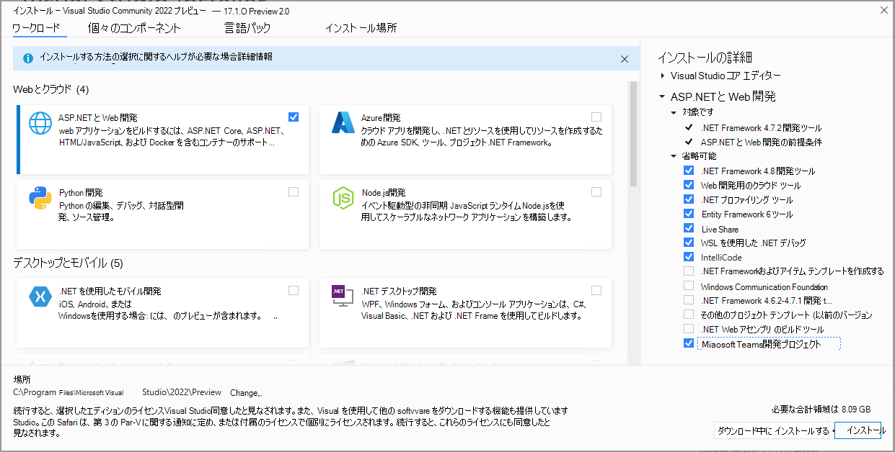

# Visual Studio 用 Teams ツールキット

IDE 内のTeamsのビルド、テスト、開発を行います。

Teams ToolkitのVisual Studio用拡張機能を使用すると、Teams用の新しいプロジェクトの作成、Teams開発者ポータルでのアプリの自動セットアップ、Teamsでの実行とデバッグ、クラウド ホスティングの構成、IDE からの [TeamsFx](https://github.com/OfficeDev/teamsfx) の使用を簡単に行うことができます。

## Visual Studio 用 Teams ツールキットのインストール

>[!NOTE]
> 前提条件として、Visual Studio 2022 17.1 Preview 2 以降を使用していることを確認し、以下の手順に従ってください。

1. Visual Studio 2022 17.1 Preview 2 が既にインストールされている場合は、次の手順にスキップします。それ以外の場合は、[Visual Studio 2022 Preview](https://visualstudio.microsoft.com/vs/preview/) をインストールします。
2. Visual Studio インストーラーを開きます。
3. 既存の VS 2022 プレビュー インストールの **[変更]** を選択します。
4. **ASP.NET と Web 開発** のワークロードを選択します。
5. 右側の **[ASP.NET と Web 開発**] セクションを展開し、オプションのコンポーネントの一覧で **Microsoft Teams 開発ツール** を選択します。
6. Visual Studio インストーラーで [**インストール**] または [**変更**] を選択して、インストール プロセスを完了します。

   

## 新しいプロジェクトですぐに使用を開始する

プロジェクト テンプレートTeams Toolkit、Teams アプリ プロジェクトを開始するために必要なすべてのコード、ファイル、および構成が提供されます。

Microsoft Teams アプリ プロジェクト テンプレートを使用すると、新しいTeams アプリを自動的に登録して構成するために必要なMicrosoft 365 アカウントを指定できます。

> [!NOTE]
> 現在 Microsoft 365 アカウントを使用していない場合は、 [Microsoft 365 開発者プログラム](https://developer.microsoft.com/microsoft-365/dev-program) サブスクリプションにサイン アップできます。 90 日間は無料で、開発アクティビティに使用している限り更新されます。 Visual Studio Enterprise または Professional サブスクリプションをお持ちの場合、両方のプログラムには、無料の Microsoft 365 [開発者向けサブスクリプション](https://aka.ms/MyVisualStudioBenefits)が含まれています。これは、Visual Studio サブスクリプションの有効期間中はアクティブです。 詳細については、[Microsoft 365 開発者サブスクリプションを設定する](/office/developer-program/office-365-developer-program-get-started)をご覧ください。

1. Visual Studio 2022を起動します。
1. スタート ウィンドウで、[ **新しいプロジェクトの作成**] を選択します。
1. [**テンプレートの検索**] ボックスにMicrosoft Teams アプリと入力します。
1. **Microsoft Teamsアプリ** テンプレートを選択し、[**次へ**] を選択します。
1. **[新しいプロジェクトの構成]** ウィンドウで、**[プロジェクト名]** ボックスに、「_HelloTeams_」と入力します。それから **[作成]** を選択します。
1. **[新しい Teams アプリケーションの作成]** ウィンドウで、**[アカウントの選択]** セレクターを使用して、Microsoft 365 アカウントを選択するかサインインします。それから **[作成]** を選択します。

   

Visual Studioが新しいプロジェクトを開き、Teams ToolkitがTeams開発者ポータルに新しいプロジェクトを設定します。 上記の手順で選択したMicrosoft 365 アカウントにリンクされたTeams組織に対してプロジェクトが追加され、新しいAzure Active Directory登録が作成されます。 これは、Teamsでアプリを実行するために必要なものです。

## Teamsでアプリを実行してデバッグする

Visual Studioからローカルで実行されているアプリ プロジェクトを起動できます。

1. [Teams アプリ プロジェクトを開くか](#get-started-quickly-with-a-new-project)作成します。
2. **F5** キーを押すか、Visual Studioで **[デバッグ] > [デバッグの開始]** を選択します。

Visual StudioブラウザーでTeams アプリ プロジェクトを起動し、デバッグを開始します。

## クラウドでTeamsアプリをホストし、プレビューする

Teams Toolkitを使用して、Azure でアプリをホストするためのクラウド リソースを作成して自動的に構成できます。

1. **クラウドメニューの Project > Teams Toolkit > Provision** を選択します。
2. [サブスクリプションの選択] ウィンドウで、リソースの作成に使用する Azure サブスクリプションを選択します。

Teams Toolkitはこのサブスクリプションに Azure リソースを作成しますが、この手順ではコードはデプロイされません。 プロジェクトをこれらの新しいリソースにデプロイするには:

1. **[クラウド] メニューの Project > Teams Toolkit >deployを** 選択します。

## クラウド リソースから実行されているアプリをプレビューする

リモート リソースを使用してブラウザーでアプリを実行し、すべてが動作することを確認できます。 このシナリオでは、まだデバッグできません。

1. メニューで **Project > Teams Toolkit > プレビューTeams アプリ** を選択します。

アプリはブラウザーで開き、プロビジョニングとデプロイの手順で作成されたリソースを使用します。

## アプリを Teams に公開する

[Teams 開発者ポータル](https://dev.teams.microsoft.com/home)では、アプリをチーム向けにアップロードしたり、組織内のユーザー向けに会社のカスタム App Store に提出したり、すべての Teams ユーザー向けに App Source に提出したりできます。

- これらの送信内容は、IT 管理者によって審査されます。
- **[Publish]** (発行) ページに戻ると提出ステータスを確認することができ、アプリが IT 管理者によって承認または却下されたかどうかを確認できます。このページでは、アプリの更新プログラムを提出したり、現在提出中のアプリをキャンセルしたりすることもできます。
