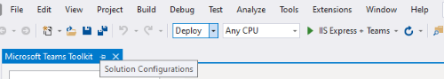

# Teams ToolkitとVisual Studioを使用してアプリを構築するBuild apps with the Teams Toolkit and Visual Studio

Microsoft Teams ツールキットを使用すると、Visual Studio 統合開発環境 (IDE) 内で直接カスタムの Teams アプリを構築できます。The Microsoft Teams Toolkit enables you to create custom Teams apps directly within the Visual Studio integrated development environment (IDE). Microsoft Teams ツールキットはプロセスをガイドし、Teams アプリの構築、デバッグ、起動に必要なすべてを提供します。The Microsoft Teams toolkit guides you through the process and provides everything you need to build, debug, and launch your Teams app.

## 前提条件Prerequisites

1. [開発者プレビューを有効に](../resources/dev-preview/developer-preview-intro.md#enable-developer-preview)する :[Enable developer preview](../resources/dev-preview/developer-preview-intro.md#enable-developer-preview).

1. **ASP.NET と Web 開発モジュール** がVisual Studioインスタンスに追加されていることを確認します。Make sure that the **ASP.NET and web development module** has been added to your Visual Studio instance. ワークロードおよびコンポーネントのドキュメントを[追加または削除して、変更Visual Studio](/visualstudio/install/modify-visual-studio?view=vs-2019&preserve-view=true)の手順に従って確認できます。You can check by following the steps in the [Modify Visual Studio by adding or removing workloads and component](/visualstudio/install/modify-visual-studio?view=vs-2019&preserve-view=true) documentation.

3. Visual Studioからアプリを展開してテストする場合は、開発環境に IIS (インターネット インフォメーション サービス) をインストールする必要があります。If you would like test your app by deploying it from Visual Studio, you'll need to have IIS (Internet Information Services) installed in your development environment. Visual Studioには IIS は含まれておらず、既定のWindows 10、Windows 8、または Windows 7 の構成には含まれません。ただし、最新バージョンは Microsoft ダウンロード[センター](https://www.microsoft.com/download/details.aspx?id=48264)からダウンロードできます。Visual Studio does not include IIS and it isn't included in the default Windows 10, Windows 8, or Windows 7 configuration; however, you can download the latest version from the [Microsoft download center](https://www.microsoft.com/download/details.aspx?id=48264).

## Teams ToolkitをインストールするInstall the Teams Toolkit

Visual StudioのMicrosoft Teams Toolkitは [、Visual Studioマーケットプレース](https://marketplace.visualstudio.com/items?itemName=TeamsDevApp.vsteamstemplate)から、またはVisual Studio内の **拡張機能** メニューから直接ダウンロードできます。The Microsoft Teams Toolkit for Visual Studio is available for download from the [Visual Studio Marketplace](https://marketplace.visualstudio.com/items?itemName=TeamsDevApp.vsteamstemplate) or directly from the **Extensions** menu within Visual Studio.

## ツールキットの使用Using the toolkit

- [新しいプロジェクトを設定するSet up a new project](#set-up-a-new-teams-project)
- [アプリを構成するConfigure your app](#configure-your-app)
- [アプリをパッケージ化するPackage your app](#package-your-app)
- [Teamsでアプリを実行するRun your app in Teams](#install-and-run-your-app-locally)
- [アプリを検証するValidate your app](#validate-your-app)
- [アプリを公開するPublish your app](#publish-your-app-to-teams)

## 新しいTeams プロジェクトを設定するSet up a new Teams project

1. [ **新しいプロジェクトの作成 ]** を選択します。Select **Create a new project**.
1. [Microsoft Teams **アプリ] を** 選択し、[**次へ**] を選択します。Choose **Microsoft Teams App** and select **Next**.
1. [**新しいプロジェクトの構成]** 画面で **、[Project名**]、[**場所**]、および **[ソリューション名**] を選択します。You will arrive at the **Configure your new project** screen where you can choose the **Project name**, **Location**, and **Solution name**.
1. [ **ソリューションとプロジェクトを同じディレクトリに配置]** というラベルの付いたチェック ボックスをオンにします。Check the box labeled **Place solution and project in the same directory**.
1. [ **機能の追加]** というラベルのポップアップ ウィンドウを使用すると、プロジェクトのセットアップに使用する 1 つ以上の機能を選択できます。A pop-up window labeled **Add Capabilities** will allow you to choose one or more capabilities for your project setup.
1. [ **次へ** ] を選択して、構成プロセスを完了します。Select the **Next** button to complete the configuration process.
1. [ **機能の追加]** というラベルのポップアップ ウィンドウを使用すると、選択した各機能のプロパティを選択できます。A pop-up window labeled **Add Capabilities** will allow you to choose the properties for each selected capability.
1. [**完了] を** 選択すると **、Microsoft Teams Toolkit** ランディング ページに移動します。Select **Finish** and you will  land on the **Microsoft Teams Toolkit** landing page.

## アプリを構成するConfigure your app

その中核となるTeamsアプリには、次の 3 つのコンポーネントが含まれます。At its core, the Teams app embraces three components:

  1. ユーザーがアプリを操作するクライアント (web、デスクトップ、モバイル) をMicrosoft Teams。The Microsoft Teams client (web, desktop or mobile) where users interact with your app.
  1. html タブコンテンツやボットアダプティブカードなど、Teamsに表示されるコンテンツの要求に応答するサーバー。A server that responds to requests for content that will be displayed in Teams, e.g., HTML tab content or a bot adaptive card .
  1. Teams アプリ パッケージは、次の 3 つのファイルで構成されます。A Teams app package consists of three files:

      > [!div class="checklist"]
      >
      > - 上のmanifest.jsThe manifest.json
      > - アプリがパブリックまたは組織のアプリ カタログに表示される[色のアイコン](../resources/schema/manifest-schema.md#icons)A [color icon](../resources/schema/manifest-schema.md#icons) for your app to display in the public or organization app catalog
      > - Teamsアクティビティ バーに表示する[アウトライン アイコン](../resources/schema/manifest-schema.md#icons)。An [outline icon](../resources/schema/manifest-schema.md#icons) for display on the Teams activity bar.

アプリがインストールされると、Teams クライアントはマニフェスト ファイルを解析して、アプリの名前やサービスが配置されている URL などの必要な情報を判断します。When an app is installed, the Teams client parses the manifest file to determine needed information like the name of your app and the URL where the services are located.

> [!NOTE]
>まだ行っていない場合は、Microsoft 365またはアカウントにサインインして開発プロセスを続行する必要があります。If you haven't done so already, you will need to sign in to your Microsoft 365  or account to continue with the development process.
>
> Microsoft 365アカウントをお持ちの場合は[、Microsoft 365デベロッパー プログラム](https://developer.microsoft.com/microsoft-365/dev-program)のサブスクリプションにサインアップできます。If you don't have a Microsoft 365 account, you can sign up for a [Microsoft 365 Developer Program](https://developer.microsoft.com/microsoft-365/dev-program) subscription. これは 90 日間 *無料* で開発活動に使用する限り継続的に更新されます。It's *free* for 90 days and will continually renew as long as you're using it for development activity. Visual Studio *Enterprise* または *Professional* サブスクリプションをお持ちの場合、両方のプログラムには、無料の Microsoft 365 [開発者向けサブスクリプション](https://aka.ms/MyVisualStudioBenefits)が含まれています。これは、Visual Studio サブスクリプションの有効期間中はアクティブです。If you have a Visual Studio *Enterprise* or *Professional* subscription, both programs include a free Microsoft 365 [developer subscription](https://aka.ms/MyVisualStudioBenefits), active for the life of your Visual Studio subscription. 詳細については、「 [Microsoft 365開発者サブスクリプションの設定](/office/developer-program/office-365-developer-program-get-started)」を参照してください。For more information, See [Set up a Microsoft 365 developer subscription](/office/developer-program/office-365-developer-program-get-started).
>

### 構成の手順Configuration steps

1. アプリを構成するには **、Microsoft Teams Toolkit** のランディング ページで、[**アプリ パッケージの編集**] を選択します。To configure your app, on the **Microsoft Teams Toolkit** landing page, select **Edit app package**.
1. [ **マイ環境]** ドロップダウン メニューから [ **開発**] を選択します。From the **My Environments** drop-down menu, select **development**.
1. **[アプリの詳細**] ページに移動して、アプリのプロパティ フィールドを編集できます。You will land on the **App details** page where you can edit your app's property fields.
1. [アプリの詳細] ページのフィールドを編集すると、最終的にアプリ パッケージの一部として出荷されるファイル上のmanifest.jsの内容が更新されます。Editing the fields in the App details page updates the contents of the manifest.json file that will ultimately ship as part of the app package. [詳細情報Learn more](https://aka.ms/teams-toolkit-manifest)

## アプリをパッケージ化するPackage your app

**アプリの詳細** ページを変更するか、アプリの .publish フォルダー内の **マニフェスト**、または **.env** ファイルを更新すると **、Development.zip** ファイルが自動的に生成されます。 Modifying the **app details** page or updating the **manifest**, or **.env** files in your app's  **.publish** folder will automatically generate your **Development.zip** file. Development.zip ファイルには **、manifest.js** と [2 つのアイコン](../concepts/build-and-test/apps-package.md#app-icons)という 3 つの必須ファイルが含まれています。The Development.zip file includes three required files — the **manifest.json** and [two icons](../concepts/build-and-test/apps-package.md#app-icons).

## アプリをローカルにインストールして実行するInstall and run your app locally

1. 次の図に示すように、[ **ソリューション構成]** ドロップダウン メニューから [ **展開** ] を選択します。From the **Solution Configurations** dropdown menu, select **Deploy** as shown in the following image:

    

2. [IIS Express **+ Teams]** ボタンを選択します。Select the **IIS Express + Teams** button.

1. Teamsが起動し、アプリのインストールダイアログがTeamsクライアントに表示されます。Teams will launch and the app installation dialogue should appear in the Teams client.

## アプリを検証するValidate your app

[ **検証]** ページでは、アプリを AppSource に提出する前にアプリ パッケージを確認できます。The **Validate** page allows you to check your app package before submitting your app to AppSource. マニフェスト パッケージをアップロードするだけで、検証ツールは、マニフェスト関連のすべてのテスト ケースに対してアプリをチェックします。Simply upload the manifest package and the validation tool will check your app against all manifest related test cases. 失敗した各テストについて、説明にエラーの修正に役立つドキュメント リンクが記載されています。For each failed tests, the description provides a documentation link to help you fix the error. 自動化が困難なテストの場合、 **暫定チェックリスト** の詳細 7 最も一般的な失敗したテスト ケースの詳細と、完全なサブミッション チェックリストへのリンク。For the tests that are hard to automate, the **Preliminary checklist** details 7 of the most common failed test cases as well as link to a complete submission checklist.

## アプリを Teams に公開するPublish your app to Teams

✔プロジェクトのホーム ページで、アプリをチームにアップロードしたり、組織のユーザー用に会社のカスタム アプリ ストアにアプリを提出したり、すべてのTeamsユーザーのアプリ ソースにアプリを送信したりできます。✔ On your project home page, you can upload your app to a team, submit your app to your company custom app store for users in your organization, or submit your app to App Source for all Teams users.

✔ IT 管理者がこれらの提出を確認します。✔ Your IT admin will review these submissions.

✔ **[発行** ] ページに戻って、申請の状態を確認し、アプリが IT 管理者によって承認または拒否されたかどうかを確認できます。また、アプリの更新を送信したり、現在アクティブな提出をキャンセルしたりすることもできます。✔  You can return to the **Publish** page to check on your submission status and learn if your app was approved or rejected by your IT admin. This is also where you'll come to submit updates to your app or cancel any currently active submissions.

## 次の手順Next step

> [!div class="nextstepaction"]
> [公開済みアプリの保守とサポートMaintaining and supporting your published app](../concepts/deploy-and-publish/appsource/post-publish/overview.md)
>
